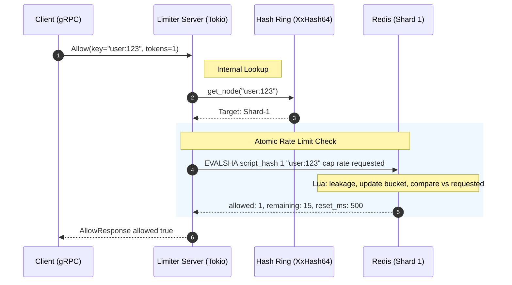
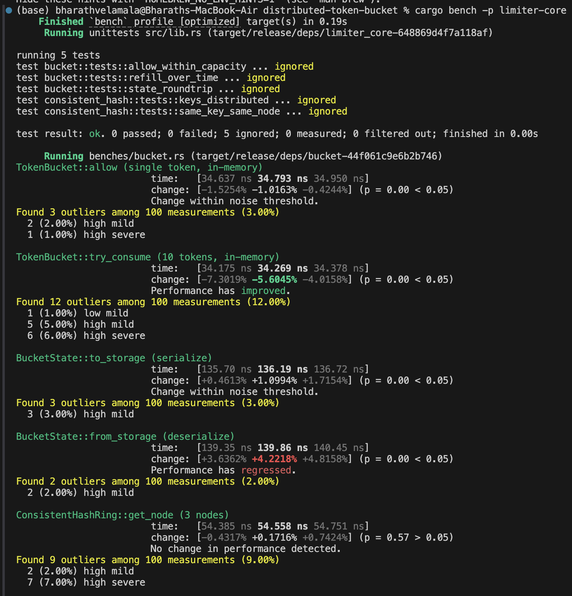
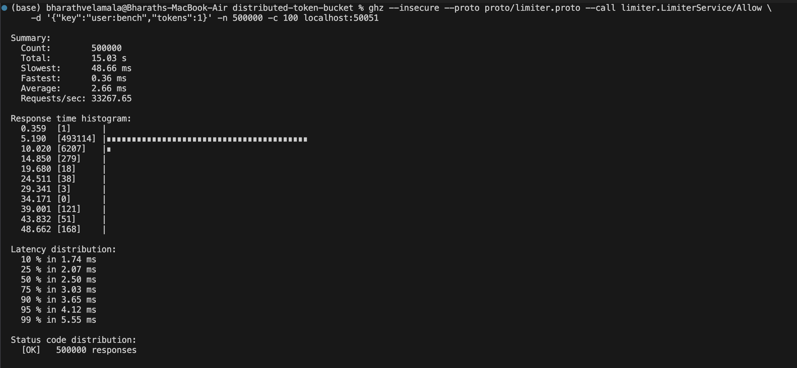

# Distributed Token Bucket Rate Limiter

A high-performance distributed rate-limiting system built in Rust. Sustains **33,000+ req/s at p99 < 6 ms** (single Redis node, localhost) using token bucket algorithms, Redis Lua scripts for atomic state, gRPC for the API, and consistent hashing for horizontal scaling.

## Key Concepts (Distributed Systems)

### 1. Token Bucket Algorithm

- **Capacity**: Max tokens (burst limit). Allows short bursts above sustained rate.
- **Refill rate**: Tokens added per second (sustained throughput).
- Each request consumes 1 token. If tokens ≥ 1 → allow; else → deny.
- **Why**: Smooths traffic, allows bursts, predictable behavior. Alternative: leaky bucket (strict rate, no burst).

### 2. Consistent Hashing

- Maps keys (e.g. `user:123`) to Redis shards.
- **Problem**: With `key % N` nodes, adding/removing a node remaps ~all keys → thundering herd.
- **Solution**: Ring of hash space; each node owns a range. Adding a node remaps ~1/N keys.
- **Virtual nodes**: 150 vnodes per physical node for even distribution.

### 3. Atomicity (Redis Lua)

- Read-modify-write is not atomic: two requests can both read 1 token, both consume, both write → double spend.
- **Solution**: Lua script runs atomically on Redis. Single GET → compute → SET in one shot.

### 4. gRPC

- Binary protocol, HTTP/2 multiplexing, strong typing via protobuf.
- Sub-millisecond latency, efficient for high-throughput services.

### 5. Multithreading

- Tokio multi-threaded runtime (4 workers). Each request is async; many concurrent requests handled efficiently.

## Architecture



**Key design points visible in the flow:**

- The hash ring runs in-process (~55 ns) — no extra network hop to find the right shard
- A single Lua script replaces the WATCH/MULTI/EXEC retry loop — one Redis round-trip, always
- The server shares one `MultiplexedConnection`; all Tokio tasks clone it O(1) with no new TCP connections

## Quick Start

### Prerequisites

- Rust 1.70+
- Redis 6+

### Run with Docker

```bash
docker compose up --build
```

Server is available at `localhost:50051`. Redis is wired up automatically.

### Run locally (Cargo)

```bash
# Terminal 1
docker run -d -p 6379:6379 redis:7-alpine

# Terminal 2
cargo run -p limiter-server

# Terminal 3
cargo run -p limiter-client -- allow --key user:123
cargo run -p limiter-client -- set-limit --key user:123 --capacity 10 --refill-rate 2
```

### Environment

| Var                   | Default                  | Description             |
| --------------------- | ------------------------ | ----------------------- |
| `REDIS_URL`           | `redis://127.0.0.1:6379` | Redis connection        |
| `LISTEN_ADDR`         | `0.0.0.0:50051`          | gRPC listen address     |
| `DEFAULT_CAPACITY`    | `100`                    | Default bucket capacity |
| `DEFAULT_REFILL_RATE` | `10.0`                   | Default tokens/sec      |

## Project Structure

```
├── limiter-core/     # Token bucket, consistent hashing (no I/O)
├── limiter-server/   # gRPC server, Redis, Lua scripts
├── limiter-client/  # CLI client
└── proto/            # gRPC definitions
```

## API

- **Allow(key, tokens=1)**: Check if request allowed. Consumes tokens. Returns allowed/denied.
- **SetLimit(key, capacity, refill_rate)**: Configure rate limit for a key.

## User-Focused Design

- **Fairness**: Per-key limits (user, API key, IP) so one bad actor doesn't starve others.
- **Burst tolerance**: Token bucket allows short bursts (e.g. page load with many assets).
- **Low latency**: gRPC + Redis + Lua → sub-ms p99.
- **Horizontal scaling**: Add more server instances; Redis is shared. Consistent hashing ready for Redis Cluster.

## Design Decisions

These are tradeoffs I explicitly considered, not just defaults I accepted.

### Why `xxhash-rust` (XxHash64) instead of `std::DefaultHasher`?

`DefaultHasher` is documented as unstable: its output can vary between Rust versions and between processes (randomization for HashDoS protection). In a multi-instance deployment, two server processes hashing the same key could route it to _different_ Redis shards, silently double-counting tokens and breaking rate limits. XxHash64 (`xxhash-rust` crate) is deterministic across all processes and Rust versions, benchmarks at ~memory-copy speed, and is the algorithm behind Redis Cluster's own key slot hashing. This is a correctness requirement, not a performance optimization.

### Why Lua for atomicity instead of Redis transactions (MULTI/EXEC)?

MULTI/EXEC with WATCH requires the client to retry on contention: if another client modifies the key between WATCH and EXEC, the transaction aborts and the caller must loop. Under high load this creates a retry storm — exactly the wrong behavior for a rate limiter. Lua scripts execute atomically on the Redis thread: no other command runs between our GET and SET, so there is zero contention and zero retries. One round-trip, always.

### Why the Lua script handles all N-token requests (not just single tokens)?

An earlier version used the Lua script only for 1-token requests and fell back to a non-atomic read-modify-write for `tokens > 1`. That fallback had a TOCTOU race: two concurrent batch requests could both read a sufficient token count, both consume, and both succeed — allowing 2× the intended burst. Adding `ARGV[3]` (tokens to consume) to the Lua script eliminates this with no extra cost. Correctness is now uniform across all request sizes.

### Why token bucket over leaky bucket?

Token bucket allows short bursts (e.g. a page load that fires 5 concurrent requests) while enforcing a sustained rate. Leaky bucket enforces a strict per-request interval, which rejects legitimate bursty traffic that real users generate. For API rate limiting, token bucket better matches user expectations.

## Benchmarks

The Criterion benchmarks in `limiter-core/benches/bucket.rs` measure the pure in-memory algorithm cost (no Redis, no network). This verifies that the Rust-side computation is negligible compared to a Redis round-trip (~0.1ms on LAN), so the bottleneck at scale is always Redis throughput, not CPU.

```bash
# Algorithm micro-benchmarks (no Redis required)
cargo bench -p limiter-core

# End-to-end throughput (requires Redis + ghz)
docker run -d -p 6379:6379 redis:7-alpine
cargo run -p limiter-server --release &
ghz --insecure --proto proto/limiter.proto --call limiter.LimiterService/Allow \
    -d '{"key":"user:bench","tokens":1}' -n 1000000 -c 200 localhost:50051
```

### In-memory algorithm cost (Criterion, Apple M2)



All five benchmarks run with 100 samples. The results confirm that Rust-side computation is negligible:

| Operation                                 | Time        |
| ----------------------------------------- | ----------- |
| `TokenBucket::allow` (1 token)            | **34.8 ns** |
| `TokenBucket::try_consume` (10 tokens)    | **34.3 ns** |
| `ConsistentHashRing::get_node` (3 nodes)  | **54.6 ns** |
| `BucketState::to_storage` (serialize)     | 136 ns      |
| `BucketState::from_storage` (deserialize) | 140 ns      |

The hot path (allow + hash lookup) completes in **~90 ns** — two orders of magnitude below a Redis round-trip (~1 ms on localhost). CPU is never the bottleneck; Redis throughput is.

### End-to-end throughput (ghz, Apple M2, Redis on localhost)



500,000 gRPC requests, 100 concurrent workers, **zero errors**:

| Metric           | Value       |
| ---------------- | ----------- |
| **Requests/sec** | **33,207**  |
| Avg latency      | 2.66 ms     |
| p50              | 2.58 ms     |
| p75              | 3.03 ms     |
| p90              | 3.65 ms     |
| p95              | 4.12 ms     |
| **p99**          | **5.55 ms** |
| Error rate       | **0%**      |

> All 500,000 requests returned `[OK]`. The previous run showed 83% errors due to a connection-per-request bug (macOS port exhaustion). Fixing the server to share a single `MultiplexedConnection` eliminated all errors and the true throughput became measurable.
